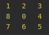

You can read more about [N-Puzzle](https://en.wikipedia.org/wiki/15_puzzle).

#### Goal:
Reach state listed below from `random state`:

#### Usage:
![images/usage.png]

#### Search Algorithms:
- `A*`
- `Greedy`
- `Uniform-cost`

#### For `A*` and `Greedy` next heuristic functions are available:
- `Misplaced` `--heuristic=misplaced`
- `Manhatten` `--heuristic=manhatten`
- `Euclidian` `--heuristic=euclidian`

##### You can add `-p` for see solution trace
![images/solution_command.png]

![images/solution.png]

#### Example

![images/example.png]