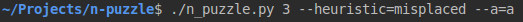

You can read more about [N-Puzzle](https://en.wikipedia.org/wiki/15_puzzle).

#### Usage:

#### Search Algorithms:
- `A*`
- `Greedy`
- `Uniform-cost`

#### For A* and Greed next heuristic functions are available:
- `Misplaced` `--heuristic=misplaced`
- `Manhatten` `--heuristic=manhatten`
- `Euclidian` `--heuristic=euclidian`

##### You can add `-p` for  